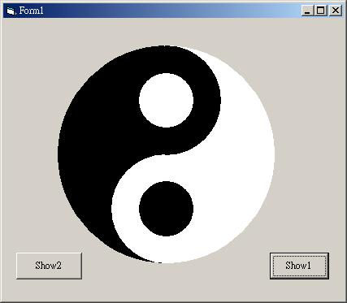



## Chinese TaiChie Oracle

### Description

This is a simple VB demo that shows how to draw a Chinese TaiChie Oracle.
 
### More Info
 

             |
---                |---
**Submitted On**   |2002-08-04 07:14:06
**By**             |[Wen\-Kai Chung](https://github.com/Planet-Source-Code/PSCIndex/blob/master/ByAuthor/wen-kai-chung.md)
**Level**          |Beginner
**User Rating**    |3.7 (11 globes from 3 users)
**Compatibility**  |VB 3\.0, VB 4\.0 \(16\-bit\), VB 4\.0 \(32\-bit\), VB 5\.0, VB 6\.0
**Category**       |[Graphics](https://github.com/Planet-Source-Code/PSCIndex/blob/master/ByCategory/graphics__1-46.md)
**World**          |[Visual Basic](https://github.com/Planet-Source-Code/PSCIndex/blob/master/ByWorld/visual-basic.md)
**Archive File**   |[Chinese\_Ta114037832002\.zip](https://github.com/Planet-Source-Code/wen-kai-chung-chinese-taichie-oracle__1-37600/archive/master.zip)

